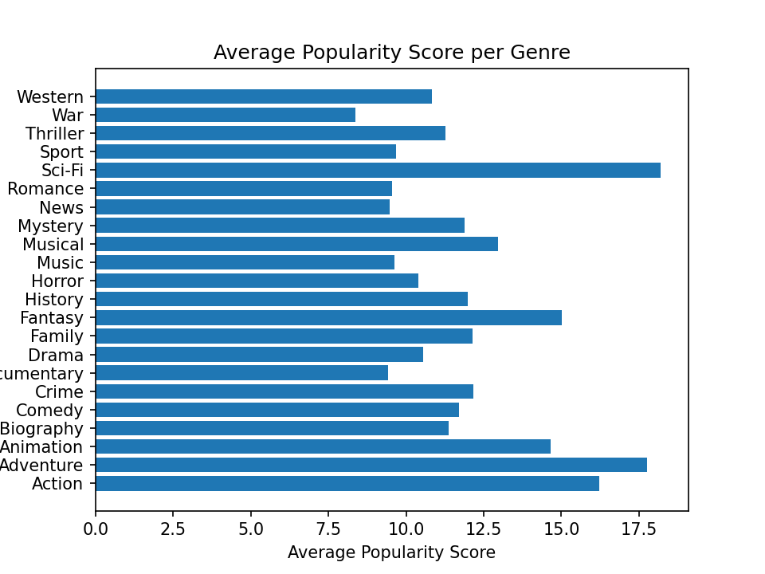

# Data Insights for Starting a New Movie Studio

**Author**: [Ruthy Yao ](mailto:ruthy.yao@gmail.com)

## Overview

This project analyses the key successful factors of a movie studio to prepare Microsoft to enter the movie production market. Description analysis of the populairty score, worldwide gross revenue, gross profit and the movie release moonth shows that the best performing genres are animations, Sci-fi and adventures anbd the best release month of a year are May, July and Novemeber. In addition, Microsoft should consider allocating at least $500m to production budget each year to run the new studio.

## Business Problem

As a new entrant to the movie production market, Microsoft has limited industry knowledge. To complete with globally well-established production companies with generally over seven to eight decades of history, it is imperative to dive into the vast movie database to distill insights on where to start, when to start and how much funding is required. This will help Microsoft to better allocate the resources and increase its chances of success. 

## Data and Methods

The analysis is built on the data collated from four well-known movie databases - IMDB, The Numbers, The Movie DataBase and Box Office Mojo. Consolidation of the four datasets brings in over 2000 movies released between 2010 and 2018. Each movie is featured with genre, release date, studio, popularity score, gross revenue and production budget.

The project uses descriptive analysis, including description of the average popularity and gross revenue by genres, the year-over-year production budget of an average studio and the trend/pattern of box office performance on a month-by-month basis over nine years' period. This provides valuable data insights to support the success of the new studio.  

## Results

The most popular, as well as the best performing genres are Animation, Sci-fi and Adventure. These genres also make the largest profit despite higher than average production budget.




Studios commit a production budget of averagely $550-$700 per annum. 


The worldwide gross revenue typically peaks in May, July and November, potentially due to school holiday and the time of annual Academy Awards. 


## Conclusions

This analysis leads to three recommendations for Microsoft to start the movie production business successfully.

_ **Focus on genres with a mix of Animation, Sci-fi and Adventure.** This type of movies have potentially the broadest span of audience demographics. Hence from popularity and box office performance persepctives, those types of movie deliver the most success. 

_ **Allocate at least $500m budget to movie production each year.** Given that a movie costs averagely $40m to $50m to produce with the Animation/Sci-fi/Adventure requiring even higher budget(at least $80m), Microsfot need to be prepared to invest at least $500m per year to to the new studio in order to make an impactful debut to the movie market as well as sustain the ongoing success of the studio. 

_ **Release movies in May/July or November to maximize the box office revenue and achieve the best theatrical view.** School holiday season is the best time to relase movie, especially for the Animation/Sci-fi/Adventure genres that target kids and families. Novermber is also a good time to release movie if Microsoft wants to compete in the upcoming Academy Awards as releasing a movie two or three months before the nomination of the awards will make it fresh in the voters' mind, increasing the chances of win.   

### Nest Steps
Further analyses could yield additional insights to further increase the chances of success of the new studio:

_ **Modelling to extract the insights from movie reviews and critiques** - Extracting and analysing data from reviews and critiques can unveil further insights on what kinds of movies are liked or disliked by the public.  

_ **Customer segmentation analysis** - Segmenting the customers based on demographics to analyze the genre prefernece and viewing behaviours of different customer groups. This will allow Miscrosoft to target certain customer groups for the movie production.

_ **Awards analysis** - Dive into the Oscar-awarded movies to identify the key attributes of successful movies. 

## For More Information

See the full analysis in the [Jupyter Notebook](./Data_Insights_for_New_Movie_Studio.ipynb) or review this [presentation](./Data_Insights_for_New_Movie_Studio_Presentation.pdf).

For additional info, contact Ruthy Yao at [zejia.yao@gmail.com](mailto:zejia.yao@.com)

## Repository Structure

```
├── Data
│   ├── Source Data
│       ├── bom.movie_gross.csv
│       ├── imdb.title.basics.csv
|       ├── tmdb.movies.csv
│       └── tn.movie_budgets.csv
|   ├── df_movie.ipynb
|   └── df_movie_explode.ipynb
├── images
├── Data_Insights_for_New_Movie_Studio.ipynb 
├── Data_Insights_for_New_Movie_Studio_presentation.pdf
└── README.md
```
